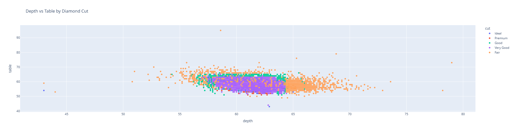

## Diamond-Analysis

## Objective

- Analysis diamond dataset tp drive insight
- Apply skills needed to manipulate and analyze diverse dataset confidently.

## Data Dictionary

| Column Name | Description                                                |
| ----------- | ---------------------------------------------------------- |
| price       | price in US dollars (\$326--\$18823)                       |
| carat       | weight of the diamond (0.2--5.01)                          |
| cut         | quality of the cut (Fair, Good, Very Good, Premium, Ideal) |
| color       | diamond colour, from J (worst) to D (best) |
| clarity     |  a measurement of how clear the diamond is (I1 (worst), SI2, SI1, VS2, VS1, VVS2, VVS1, IF (best))                                                           |
| x           | length in mm (0--10.74)                                    |
| y           | width in mm (0--58.9)                                      |
| z           | depth in mm (0--31.8)                                      |
| depth       | total depth percentage                                     |
| table       | width of top of diamond relative to widest point (43--95)  |

## Summary 
## Key Visualization 

## Visulization 1:
This is a histogram of the sum of carat of the diamond. As you can see from the graph the more `ideal` diamonds that cost far more than have a higher sum compared to the `Fair` the lowest of the carets. That is below $2K.

## Visulization 2:
This bar graph measure the `depth` to the `table`. `Table` is refer to the top of the diamond where light comes in and `depth` refers to the vertical cut at the bottom, simply put, table refers to how diamond at the bottom was cut. 

Here is a scatterplot showing out of the 5 groups, `Fair` covers a major portion of the dept while `Good` and `Very Good` have smaller portion. 

## Model 

